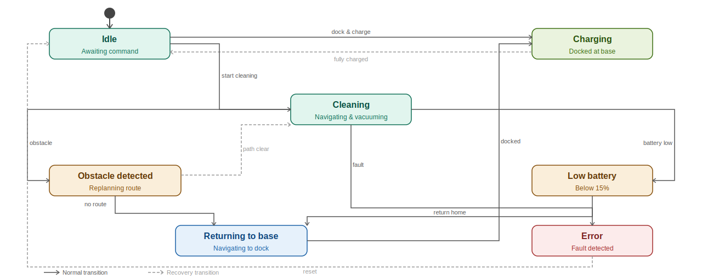
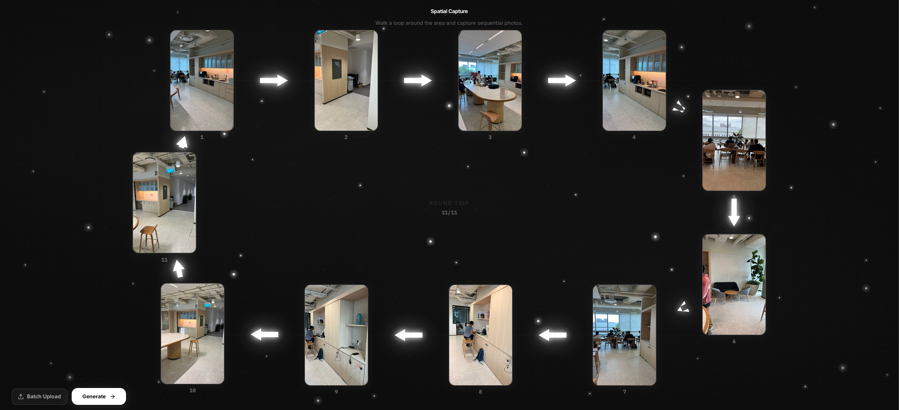
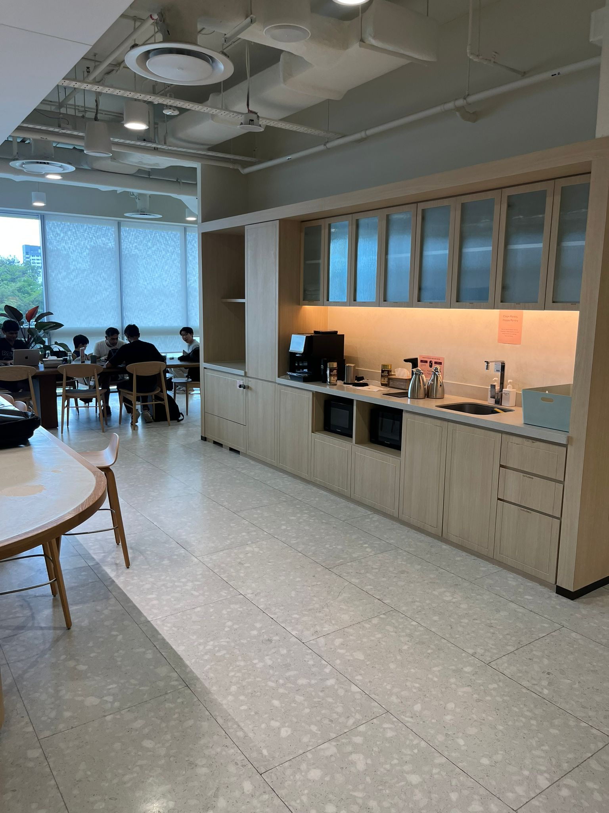
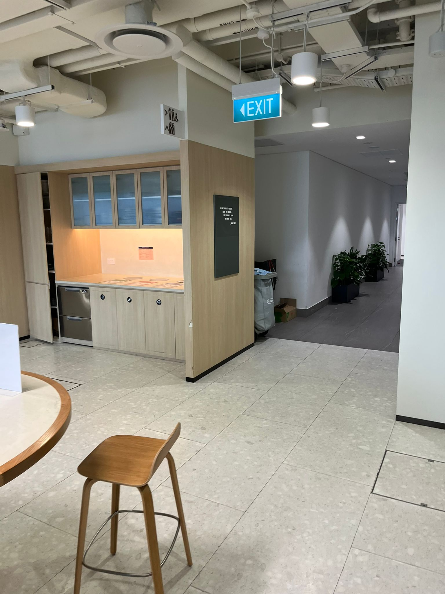
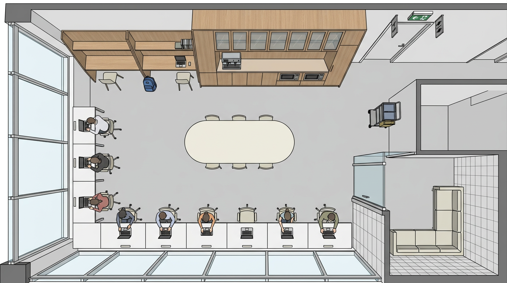
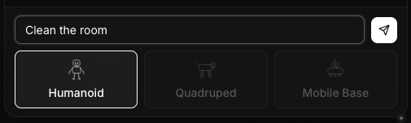
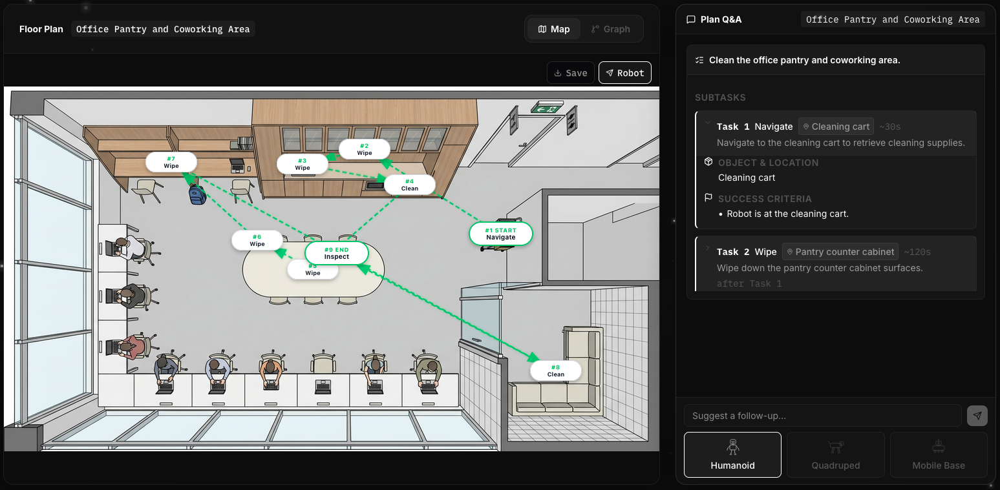

<!-- _class: title -->

<p class="cover-kicker">Machine Learning Singapore</p>

# **RPG**: Robotic Planning with Gemini

<p class="cover-authors">Anurag Roy · Chaitanya Jadhav</p>

---

<!-- _class: about-slide -->

## About Us

<div class="about-cols">
  <div class="about-col">
    
    <p class="about-name">Anurag Roy</p>
    <p class="about-title">Autonomy Engineer<br/>Griffin Labs</p>
    
  </div>
  <div class="about-col">
    
    <p class="about-name">Chaitanya Jadhav</p>
    <p class="about-title">AI Engineer<br/>PhillipCapital Pte Ltd</p>
    
  </div>
</div>

---

<!-- _class: planning-slide -->

## Why Tackle Planning?

<div class="centered-media planning-demo-media">
  
</div>

<div class="planning-note">
  Traditional approaches use state machines, which require explicit understanding of the environment and manual setting of waypoints.
</div>

---

## Why Mapping is an Important Part of Planning

- A planner needs to know what objects exist and where they are
- Map-building via LIDAR is computationally expensive
- Maps become stale quickly as objects move or rooms change
- Each new deployment environment requires a fresh mapping pass

<div class="centered-media mapping-media">
  
</div>

<small class="mapping-source">Source: Hess et al., Real-time loop closure in 2D LIDAR SLAM</small>

---

## How LLMs and VLAs Change the Game

- Models already understand rooms, objects, and spatial relationships
- This can be leveraged for dynamic mapping and planning 

<div class="centered-media object-demo-media">
  
</div>
<small class="mapping-source">Source: Gemini Robotics-ER1.5 Demo</small>

---

## Our Approach

- Built on the Google AI Stack: Gemini 3, Nano Banana
- Input: sequential photographs from an indoor space
- Output: 
  1. Structured floor map
  2. Embodiment-aware task plans


---

## Stage 1: Scene Decomposition

<div class="centered-media scene-input-media">
  
</div>

- Photos are sent as a single multimodal prompt to Gemini
- Model returns structured JSON for each image
---

## Stage 1: Scene Decomposition

From these inputs..
<div class="centered-media two-up-media">
  
  
</div>

---

<!-- _class: scene-json -->

## Stage 1: Scene Decomposition

We get this: 
```json
{
  "node_name": "Office Pantry and Coworking Area",
  "static_anchors": [
    {
      "anchor_id": "pantry_counter_cabinet",
      "type": "wooden pantry cabinet",
      "description": "A large floor-to-ceiling wooden cabinetry unit with glass-front upper sections."
    },
    ...
  ],
  "dynamic_objects": [
    {
      "object_id": "coffee_espresso_machine",
      "type": "coffee machine",
      "description": "A black professional espresso machine on the main pantry countertop."
    }
  ],
  "navigable_edges": [
    {
      "edge_id": "hallway_exit_path",
      "description": "A corridor leading away from the pantry towards restrooms and building exits.",
      "visual_cue": "Illuminated green EXIT sign and overhead restroom pictograms."
    }
  ]
}
```

---

## Stage 2: Layout Synthesis

- Step 1: Generate a text description of the room and all objects inside it 
- Step 2: Generate a floor plan with Nano Banana

<div class="centered-media map-media">
  
</div>

---

## Stage 3: Object Localization
Create bounding boxes for identified objects for downstream planning tasks

```json
[
  { "object_id": "pantry_counter_cabinet", "ymin": 5,  "xmin": 35, "ymax": 30, "xmax": 95 },
  { "object_id": "oval_communal_table",    "ymin": 35, "xmin": 30, "ymax": 65, "xmax": 70 },
  { "object_id": "coffee_espresso_machine","ymin": 8,  "xmin": 60, "ymax": 20, "xmax": 75 }
]
```


---

## Embodiment-Aware Planning

- Goal: convert user intent into tasks that can be carried out by a robot
- Analogy: "Plan Mode" for Robots
  1. Generate sub-tasks to execute
  2. List affected objects
  3. List pre-requisite tasks
- Input: robot type, room entities and locations, user goal

<div class="centered-media">
  
</div>

---

## Embodiment-Aware Planning

Account for different action spaces by maintaining a list of "skills" for each embodiment

```python
ALLOWED_ACTIONS = {
    "humanoid": {
        "navigate", "move_to", "pick_up", "place", "grab", "carry", "open",
        "close", "push", "pull", "reach", "lift", "lower", "pour", "turn_on",
        # ... 70 actions
    },
    "quadruped": {
        "navigate", "move_to", "patrol", "inspect", "monitor", "push_low",
        "nudge", "follow", "guard", "detect", "sniff", "alert", "wait",
        # ... 25 actions
    },
    "mobile_base": {
        "navigate", "move_to", "sweep", "clean", "mop", "vacuum", "avoid",
        "patrol", "cover_area", "dock", "undock", "wait", "inspect_floor",
        # ... 21 actions
    },
}
```
---

## Output

<div class="centered-media planning-demo-media">
  
</div>

---

## Production Deployment & Evaluation

- We can think of plan generation as an extension of code generation tasks
- **Test-driven planning**: the planner re-runs until all constraints are satisfied
  - Constraints can be derived from robot's action space or physical limits
  - Examples: a quadruped cannot `pick_up`; a mobile base cannot `open` a door
- We are just evaluating plan generation - whether these plans can be executed is a different story

---

# Walkthrough